# Diagramas Fase 2 - Proyecto Estructuras de Datos

Documento con diagramas UML de clases, TADs y arquitectura del sistema de gestión de sucursales y traslados de productos.

---

## 1. Diagrama de Clases General

Relaciones de composición, agregación y herencia del sistema completo.

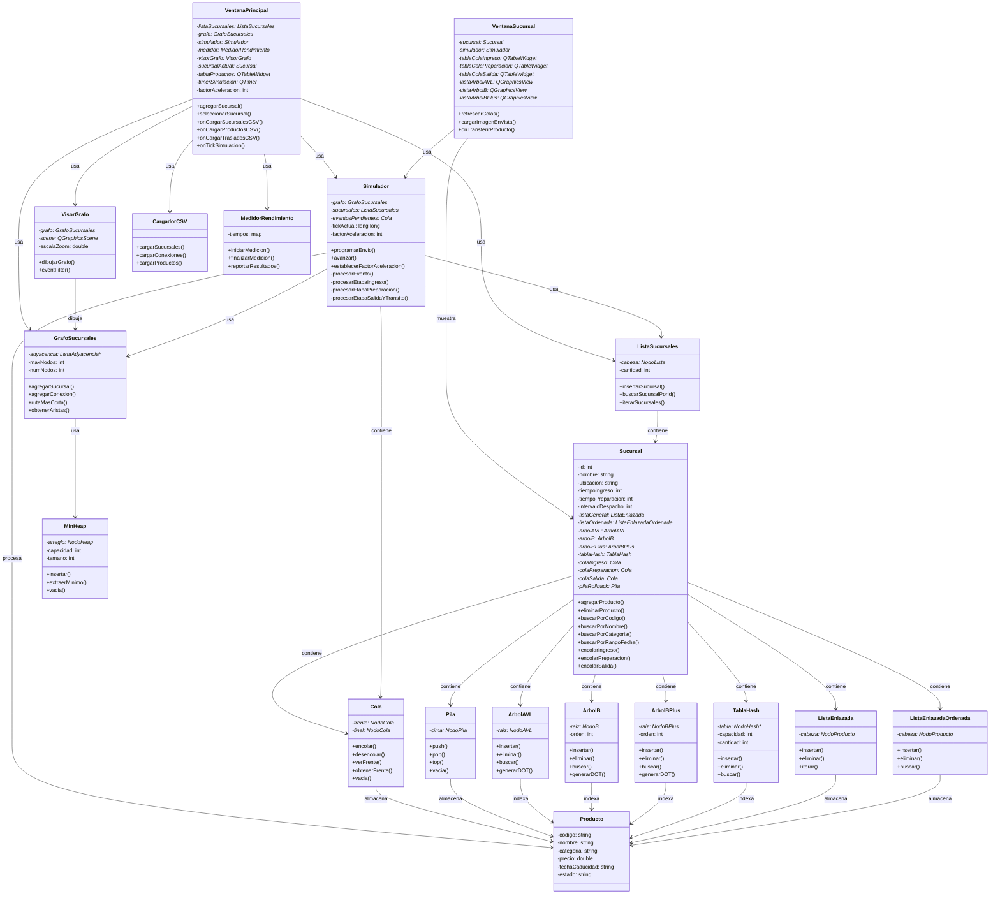

---

## 2. Diagramas de TAD (Tipos Abstractos de Datos)

### 2.1 TAD Cola (FIFO)

```mermaid
graph TB
    subgraph COLATAD["TDA Cola (FIFO)"]
        direction LR
        
        subgraph def["Definición"]
            D1["Cola = conjunto de elementos Producto"]
            D2["Operación: FIFO (primero en entrar, primero en salir)"]
            D3["No se permite acceso a elementos intermedios"]
        end
        
        subgraph impl["Implementación"]
            I1["Nodos enlazados: NodoCola*"]
            I2["frente: puntero al primer nodo"]
            I3["final: puntero al último nodo"]
        end
        
        subgraph ops["Operaciones O(1)"]
            O1["encolar(p): inserta al final"]
            O2["desencolar(): elimina del frente"]
            O3["verFrente(): acceso solo lectura"]
            O4["obtenerFrente(): retorna NodoCola* para iteración"]
            O5["vacia(): consulta estado"]
        end
        
        def --> impl
        impl --> ops
    end
```

### 2.2 TAD Pila (LIFO)

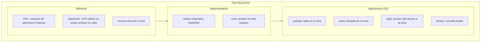

### 2.3 TAD GrafoSucursales (Dijkstra)

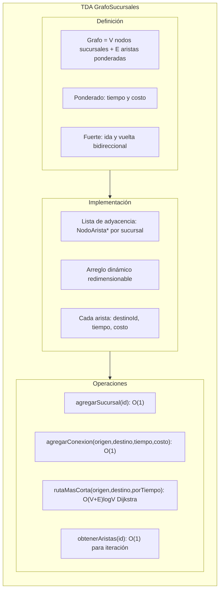

### 2.4 TAD MinHeap (Cola de Prioridad)

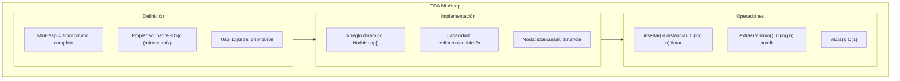

### 2.5 TAD Simulador (Máquina de Estados)

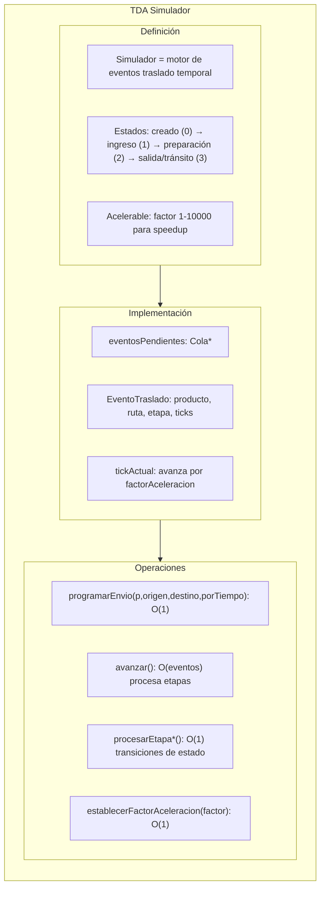

### 2.6 TAD ArbolAVL (Búsqueda Balanceada)

```mermaid
graph TB
    subgraph AVLTAD["TDA ArbolAVL"]
        direction LR
        
        subgraph def["Definición"]
            D1["ArbolAVL = árbol BST autobalanceado"]
            D2["Propiedad: |altura(izq) - altura(der)| ≤ 1"]
            D3["Búsqueda por nombre: O(log n)"]
        end
        
        subgraph impl["Implementación"]
            I1["Nodos: NodoAVL* con altura"]
            I2["Factor balance: calculado en inserción/eliminación"]
            I3["Rotaciones: simple y doble"]
        end
        
        subgraph ops["Operaciones"]
            O1["insertar(p): O(log n) con rebalance"]
            O2["eliminar(p): O(log n) con rebalance"]
            O3["buscar(nombre): O(log n) BST"]
            O4["generarDOT(): O(n) visualización Graphviz"]
        end
        
        def --> impl
        impl --> ops
    end
```

### 2.7 TAD ArbolB (Búsqueda Rango por Fecha)

```mermaid
graph TB
    subgraph BTAD["TDA ArbolB"]
        direction LR
        
        subgraph def["Definición"]
            D1["ArbolB = árbol de búsqueda multikey"]
            D2["Propiedad: 1 a orden-1 claves por nodo"]
            D3["Búsqueda por rango de fechas: O(log n + k)"]
        end
        
        subgraph impl["Implementación"]
            I1["Nodos: NodoB* con múltiples claves"]
            I2["Inserción/eliminación: split/merge"]
            I3["Mantiene balance por count mínimo"]
        end
        
        subgraph ops["Operaciones"]
            O1["insertar(p,fecha): O(log n)"]
            O2["eliminar(p,fecha): O(log n)"]
            O3["buscarRango(inicio,fin): O(log n+k)"]
            O4["generarDOT(): O(n) visualización"]
        end
        
        def --> impl
        impl --> ops
    end
```

### 2.8 TAD ArbolBPlus (Búsqueda por Categoría)

```mermaid
graph TB
    subgraph BPLUSTAD["TDA ArbolBPlus"]
        direction LR
        
        subgraph def["Definición"]
            D1["ArbolBPlus = B+ con hojas enlazadas"]
            D2["Índices en nodos internos, datos en hojas"]
            D3["Búsqueda por categoría: O(log n + k)"]
        end
        
        subgraph impl["Implementación"]
            I1["Nodos internos: NodoBPlus* sin datos"]
            I2["Hojas: contienen Producto* y siguiente"]
            I3["Recorrido lineal en hojas"]
        end
        
        subgraph ops["Operaciones"]
            O1["insertar(p,categoria): O(log n)"]
            O2["eliminar(p,categoria): O(log n)"]
            O3["buscarCategoria(nombre): O(log n+k)"]
            O4["generarDOT(): O(n) visualización"]
        end
        
        def --> impl
        impl --> ops
    end
```

### 2.9 TAD TablaHash (Búsqueda Directa por Código)

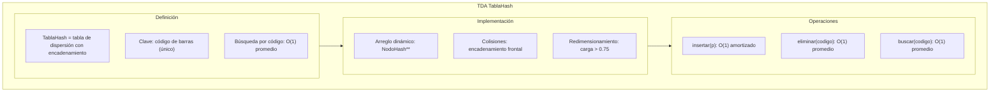

### 2.10 TAD ListaEnlazada (Inventario General)

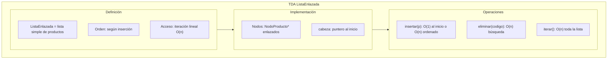

### 2.11 TAD ListaEnlazadaOrdenada (Búsqueda por Nombre)

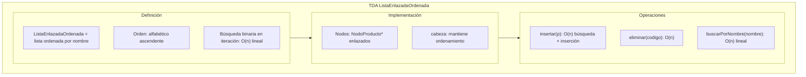

---

## 3. Red de Sucursales (Ejemplo Visual)

Grafo de 5 sucursales conectadas con pesos de tiempo y costo.

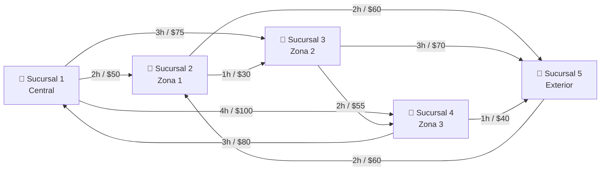

**Matriz de Conexiones:**
| Origen | Destino | Tiempo (h) | Costo ($) |
|--------|---------|-----------|-----------|
| 1 | 2 | 2 | 50 |
| 1 | 3 | 3 | 75 |
| 1 | 4 | 4 | 100 |
| 2 | 1 | 2 | 50 |
| 2 | 3 | 1 | 30 |
| 2 | 5 | 2 | 60 |
| 3 | 1 | 3 | 75 |
| 3 | 2 | 1 | 30 |
| 3 | 4 | 2 | 55 |
| 3 | 5 | 3 | 70 |
| 4 | 1 | 4 | 100 |
| 4 | 3 | 2 | 55 |
| 4 | 5 | 1 | 40 |
| 5 | 2 | 2 | 60 |
| 5 | 3 | 3 | 70 |
| 5 | 4 | 1 | 40 |

---

## 4. Máquina de Estados del Simulador

Transiciones de un producto en traslado entre sucursales.

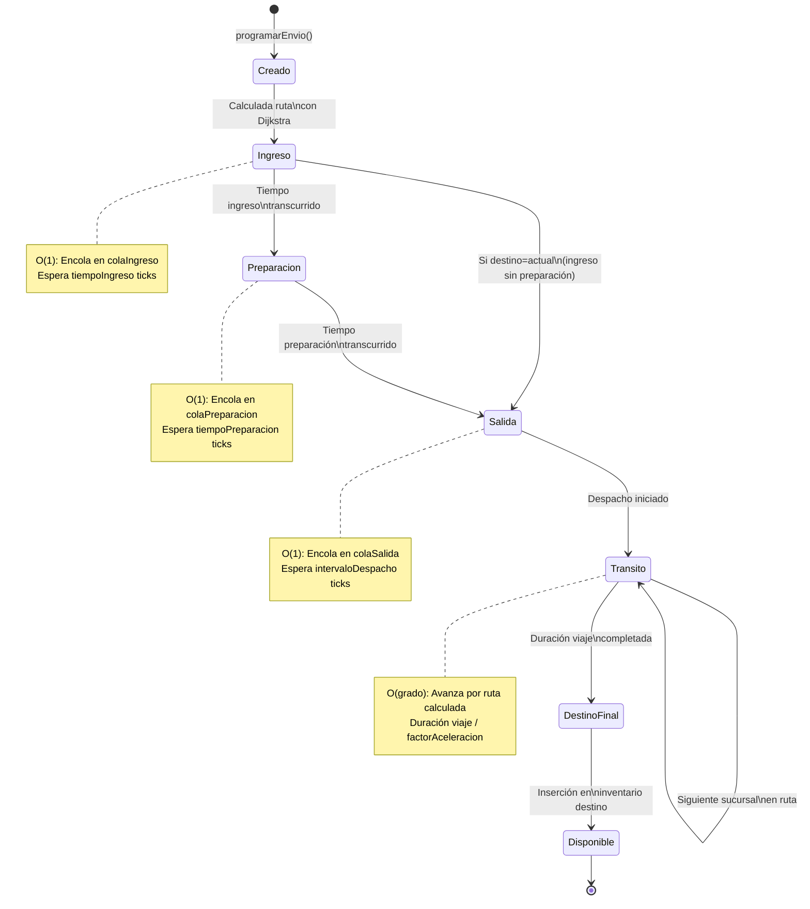

---

## 5. Flujo de Datos en Traslado

Cómo fluye un producto desde programación hasta llegada.

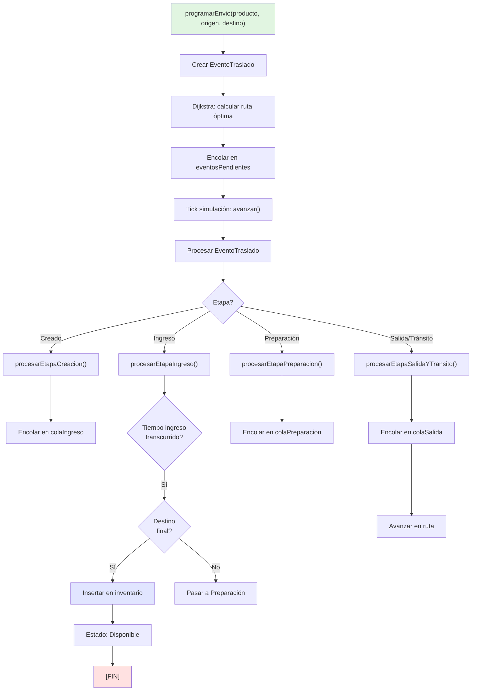

---

## 6. Resumen de Complejidades

### Operaciones por Estructura

| Estructura | Insertar | Eliminar | Buscar | Generación DOT |
|-----------|----------|----------|--------|-----------------|
| ListaEnlazada | O(1) inicio, O(n) ordenada | O(n) | O(n) | O(n) |
| ListaEnlazadaOrdenada | O(n) | O(n) | O(n) | O(n) |
| ArbolAVL | O(log n) | O(log n) | O(log n) | O(n) |
| ArbolB | O(log n) | O(log n) | O(log n) | O(n) |
| ArbolBPlus | O(log n) | O(log n) | O(log n) + O(k) | O(n) |
| TablaHash | O(1) amort. | O(1) prom. | O(1) prom. | O(n) |
| Cola | O(1) encolar | O(1) desencolar | O(1) frente | - |
| Pila | O(1) push | O(1) pop | O(1) top | - |
| MinHeap | O(log n) | O(log n) | - | - |
| GrafoSucursales | O(1) | O(1) eliminar edge | O(V+E)logV Dijkstra | O(V+E) |

### Operaciones del Simulador

| Operación | Complejidad | Descripción |
|-----------|-------------|-------------|
| programarEnvio() | O((V+E) log V) | Cálculo de ruta Dijkstra |
| procesarEtapaIngreso() | O(1) | Transición de estado |
| procesarEtapaPreparacion() | O(1) | Transición de estado |
| procesarEtapaSalidaYTransito() | O(grado) | Avance en ruta |
| avanzar() | O(eventos) | Procesa todos los eventos |
| establecerFactorAceleracion() | O(1) | Setter simple |

---

## 7. Notas Técnicas

- **Aceleración**: Factor por defecto 1000x; tickActual avanza 1000 ticks por llamada a `avanzar()`.
- **Dijkstra**: Se aplica en `procesarEtapaCreacion()` para calcular ruta óptima (tiempo o costo).
- **Redimensionamiento**: TablaHash y MinHeap se redimensionan cuando alcanzan límites de ocupación.
- **Graphviz**: Los TADs de búsqueda (AVL, B, B+) generan `.dot` que se convierten a `.png` con `dot`.
- **Sincronización**: Todas las estructuras comparten `Producto*` por referencia; operaciones de inserción mantienen consistencia transaccional.

---

**Fecha de generación**: Fase 2 - Gestión de Sucursales y Traslados de Productos
**Sistema**: Proyecto Estructuras de Datos PS2026 - USAC
